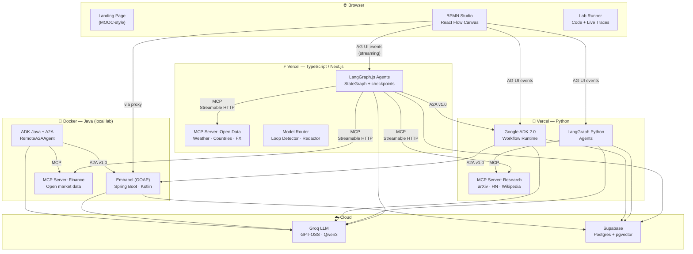

# 🤖 Agentic AI Lab

> **A complete, runnable learning platform for production-grade Agentic AI** — covering every orchestration pattern, protocol, and cross-stack scenario across TypeScript, Python, and Java.

[](https://www.typescriptlang.org/)
[](https://python.org)
[](https://openjdk.org)
[](https://github.com/langchain-ai/langgraph)
[](https://adk.dev/2.0/)
[](https://github.com/embabel/embabel-agent)
[](https://modelcontextprotocol.io)
[](https://google.github.io/a2a)
[](https://vercel.com)
[](LICENSE)

---

## 🌐 Live Demo

| Surface | URL |
|---|---|
| 🎓 Learning Platform + Studio | `https://agentic-ai-lab.vercel.app` |
| 🔌 Open Data MCP Server | `https://agentic-ai-lab.vercel.app/mcp/open-data` |
| 🔬 Research MCP Server | `https://agentic-ai-lab.vercel.app/mcp/research` |

Java agents run locally via Docker (see [Quickstart](#-quickstart)).

---

## 🏗️ Architecture



---

## ⚡ Quickstart

```bash
# 1. Clone
git clone https://github.com/ShishirRao/agentic-ai-lab.git && cd agentic-ai-lab

# 2. Configure (fill in your Groq + Supabase keys)
cp .env.example .env

# 3. Install all workspaces
pnpm install

# 4. Run migrations on your Supabase project
pnpm supabase:migrate

# 5. Start the Studio (Next.js)
pnpm studio
# → http://localhost:3000

# Optional: start Java agents with Docker
docker-compose --profile java up
```

> **Groq API key:** get a free key at [console.groq.com](https://console.groq.com)
> **Supabase:** create a free project at [supabase.com](https://supabase.com), paste URL + keys into `.env`

---

## 📚 Curriculum

Three progressive learning tracks. Every module links to a runnable lab inside the Studio.

### 🌱 Beginner Track — *Get agents working fast*

| # | Module | Stack | Lab |
|---|--------|-------|-----|
| 1.1 | Chat Completions and Streaming | TS · Py · Java | `/labs/foundations/chat` |
| 1.2 | **Client Zoo** — 6 ways to call the same API | TS · Py · Java | `/labs/foundations/clients` |
| 1.3 | Structured Outputs (Zod / Pydantic / Records) | TS · Py · Java | `/labs/foundations/structured` |
| 1.4 | Naive RAG (chunk → embed → pgvector → retrieve) | TS | `/labs/rag/naive` |
| 1.5 | Tool / Function Calling basics | TS | `/labs/foundations/tools` |

### 🚀 Practitioner Track — *Build real agent systems*

| # | Module | Stack | Lab |
|---|--------|-------|-----|
| 2.1 | **MCP Servers** — Streamable HTTP, tools, resources, prompts | TS · Py · Java | `/labs/mcp/server` |
| 2.2 | MCP Elicitation and Sampling (2025-06-18 spec) | TS | `/labs/mcp/elicitation` |
| 2.3 | MCP Apps — interactive UI results | TS | `/labs/mcp/apps` |
| 2.4 | **Agentic RAG** — Self-RAG · Corrective RAG · Query Decomposition | TS · Py | `/labs/rag/agentic` |
| 2.5 | GraphRAG-lite (entity extraction + graph traversal) | Py | `/labs/rag/graph` |
| 2.6 | RAG Evals (faithfulness, relevance, groundedness) | TS · Py | `/labs/rag/evals` |
| 2.7 | Orchestration Patterns — full catalog (see below) | TS · Py | `/labs/patterns/*` |
| 2.8 | **Agent Observability** — OTel GenAI conventions → Supabase | TS · Py | `/labs/production/observability` |
| 2.9 | **Intelligent Model Routing** (complexity classifier) | TS | `/labs/production/routing` |
| 2.10 | Infinite Loop and Runaway Cost Detection | TS | `/labs/production/loop-detection` |
| 2.11 | PII Redaction middleware | TS | `/labs/production/redaction` |
| 2.12 | Input/Output Guardrails (prompt-injection defense) | TS · Py | `/labs/production/guardrails` |

### 🏗️ Architect Track — *Cross-stack, cross-protocol scenarios*

| # | Module | Stack | Lab |
|---|--------|-------|-----|
| 3.1 | **A2A v1.0** — AgentCards, task lifecycle, cross-stack calls | TS · Py · Java | `/labs/protocols/a2a` |
| 3.2 | **AG-UI** — Event streaming protocol (agent → frontend) | TS | `/labs/protocols/ag-ui` |
| 3.3 | **A2UI** — Persistent state sync (agent ↔ UI) | TS | `/labs/protocols/a2ui` |
| 3.4 | **AP2 / x402** — Agent-native payments | TS | `/labs/protocols/ap2` |
| 3.5 | **WebMCP** — MCP in the browser (W3C preview) | TS | `/labs/protocols/webmcp` |
| 3.6 | **Embabel** — GOAP planning on the JVM | Java/Kotlin | `/labs/java/embabel` |
| 3.7 | **Google ADK 2.0** — Workflow Runtime + Task API | Py · Java | `/labs/adk` |
| 3.8 | Cross-stack interop matrix (TS supervisor → Py researcher → Java planner) | All | `/labs/interop` |
| 3.9 | **Agent Memory** — short-term / long-term / episodic | TS · Py | `/labs/production/memory` |
| 3.10 | **Agent Evals** — trajectory scoring + outcome scoring | TS · Py | `/labs/production/evals` |
| 3.11 | Long-running durable agents (checkpoint + time-travel) | TS | `/labs/patterns/durable` |

---

## 🎼 Orchestration Patterns Catalog

Every pattern has a live canvas in the Studio.

| Pattern | Description | Stacks |
|---------|-------------|--------|
| Prompt Chaining | Sequential LLM calls, each output feeds next | TS |
| Routing | Classifier picks the right sub-chain | TS · Py |
| Parallelization — Sectioning | Fan-out tasks, merge results | TS |
| Parallelization — Voting | N agents vote, majority wins | TS |
| Orchestrator → Workers | Planner delegates to specialist agents | TS · Py |
| Evaluator–Optimizer | Reflection loop until quality gate passes | TS |
| ReAct | Reason → Act → Observe loop | TS · Py |
| Plan-and-Execute | Upfront plan, then execute steps | TS |
| Reflection / Self-Critique | Agent reviews its own output | TS |
| Supervisor + Handoffs | Supervisor routes between specialist agents | TS · Py |
| Multi-Agent Swarm | Peer agents with handoff protocol | TS (LangGraph swarms) |
| Map-Reduce | Parallel processing, aggregated result | TS |
| Human-in-the-Loop | `interrupt()` for approval / clarification | TS · Py · Java |
| Deep Research | Multi-step web research → synthesis | Py |
| GOAP Planning | Goal-Oriented Action Planning (game AI applied) | Java (Embabel) |
| Durable / Long-Running | Checkpoint, resume, time-travel | TS |

---

## 🔌 MCP Servers

Three shared MCP servers (Streamable HTTP transport) accessible to all agents:

| Server | Open APIs | Deploy |
|--------|-----------|--------|
| **ts-open-data** | Open-Meteo (weather), REST Countries, Frankfurter (FX) | Vercel |
| **py-research** | arXiv, Hacker News Algolia, Wikipedia | Vercel |
| **java-finance** | Open exchange rates, CoinGecko (free tier) | Docker |

---

## 📡 Protocols Covered

| Protocol | What it solves | 2026 Status |
|----------|---------------|-------------|
| **MCP** | Agent ↔ Tools/Resources | Stable spec 2025-06-18; RC 2026-07-28 |
| **A2A v1.0** | Agent ↔ Agent (cross-org, cross-stack) | 150+ orgs, AWS/Azure/GCP production |
| **AG-UI** | Agent → Frontend (event streaming) | CopilotKit / LangChain |
| **A2UI** | Agent ↔ Frontend (persistent state sync) | Available |
| **AP2** | Agent ↔ Payments | Teach + minimal demo |
| **x402** | HTTP-native micropayments for agents | Teach + minimal demo |
| **WebMCP** | MCP inside the browser (W3C track) | Chrome Canary preview |

---

## 🛠️ Tech Stack

```
Frontend          Next.js 15 · React 19 · Tailwind CSS · React Flow (xyflow) · shadcn/ui
TypeScript agents LangGraph.js 1.x · Vercel AI SDK · @modelcontextprotocol/sdk · Groq SDK
Python agents     LangGraph 1.x · google-adk 2.x · FastAPI · openai (→Groq)
Java agents       Embabel 0.3.x · Google ADK-Java 1.x · Spring Boot 3.x · Kotlin
Protocols         MCP · A2A v1.0 · AG-UI · A2UI · AP2
LLMs              Groq (openai/gpt-oss-120b · gpt-oss-20b · qwen/qwen3.6-27b)
Database          Supabase (Postgres 16 + pgvector) — RAG, checkpoints, traces, memory
Observability     OpenTelemetry GenAI conventions · Langfuse · custom Supabase trace sink
Infra             Vercel (TS/Py) · Docker Compose (Java) · Supabase · GitHub Actions
```

---

## 📁 Repo Structure

```
AgenticAI/
├── apps/
│   └── studio/              # Next.js 15 — Learning Platform + BPMN Studio
├── agents/
│   ├── langgraph-ts/        # LangGraph.js agents (TypeScript)
│   ├── langgraph-py/        # LangGraph Python agents          [Phase 2]
│   ├── adk-py/              # Google ADK 2.0 Python            [Phase 2]
│   ├── adk-java/            # ADK-Java + A2A (Docker)          [Phase 3]
│   └── embabel-java/        # Embabel GOAP (Docker)            [Phase 3]
├── mcp-servers/
│   ├── ts-open-data/        # TS — weather, countries, forex
│   ├── py-research/         # Python — arXiv, HN, Wikipedia    [Phase 2]
│   └── java-finance/        # Java — open market data          [Phase 3]
├── packages/
│   ├── contracts/           # Zod schemas: AG-UI, traces, runs
│   └── observability/       # OTel GenAI tracer → Supabase sink
├── protocols/
│   ├── a2a/                 # AgentCards + cross-stack demos
│   └── ag-ui/               # AG-UI event schema + middleware
├── supabase/
│   └── migrations/          # pgvector, documents, traces, checkpoints
├── docs/                    # The curriculum — numbered, linked to labs
├── docker-compose.yml       # One-command local lab
└── .env.example             # All env vars documented
```

---

## 🗺️ Roadmap

- [x] **Phase 0** — Monorepo skeleton, Supabase migrations, README
- [x] **Phase 1** — Studio landing page + canvas, client zoo, agentic RAG, ts-open-data MCP server, observability v1
- [ ] **Phase 2** — Python agents (LangGraph + ADK 2.0), patterns catalog, model routing, loop detection, redaction
- [ ] **Phase 3** — Java agents (Embabel + ADK-Java), A2A cross-stack demos, interop matrix
- [ ] **Phase 4** — Protocol deep-dives (AG-UI, A2UI, AP2, WebMCP, MCP elicitation/sampling/Apps)
- [ ] **Phase 5** — Agent evals, memory, guardrails, cost dashboard, polish

---

## 📄 License

MIT © Shishir Rao — learn, fork, build, teach.

---

> **Found this useful?** Give it a ⭐ and share it — the goal is to help more developers build production-grade agents.
